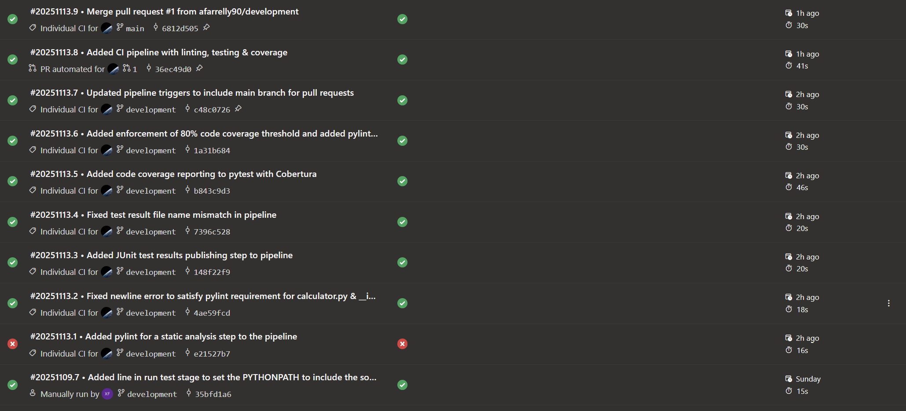

# X00203931 – CI Pipeline for Python Calculator App

## Overview
This project implements a Continuous integration (CI) pipeline for the use in a simple Python calculator application.

The goal when creating this project was for demonstrating proper DevOps practices such as:
- Azure Pipelines YAML pipeline
- Github based source controls
- Branching & pull request workflows
- Static code analysis with Pylint
- Strict >80% test code coverage (enforced)
- Automated testing and building
- Branching protection rules and appropriate requied checks.

## Technologies used
- Python 3.12
- Azure Pipelines (YAML)
- GitHub (branching,commits, pull requests, branch rules)
- PyTest (unit testing)
- pytest-cov (coverage enforcement)
- Pylint (static analysis)
- Ubuntu-latest build agents

## Local development setup
```bash
# Clone repository
git clone https://github.com/afarrelly90/X00203931_CA2
cd X00203931_CA2

# create virtual environment
python -m venv env
source env/bin/activate
env\Scripts\activate

# install dependencies
pip install -r requirements.txt
# run tests
pytest --cov=app
# run linter (pylint)
pylint app
```
## Application Features
The calculator performs mathematical operations between **two float numbers** (**a** and **b**)
- **add(a, b)** – adds **a** and **b**
- **sub(a, b)** – subtracts **b** from **a**
- **multi(a, b)** – multiplies **a** by **b**
- **div(a, b)** – divides **a** by **b** (raises ValueError on division by zero)


## CI Pipeline Implementation
The pipeline is defined in **azure-pipelines.yml** and includes:
### PR + Trigger setup
Both PR and direct push builds are enabled.
Pipeline triggers on commits to **main** & **development** branches.

